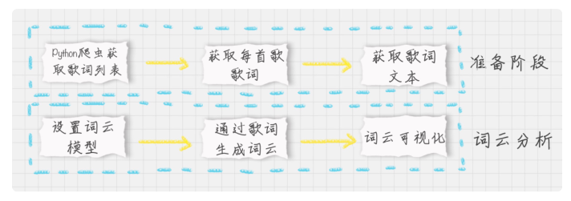
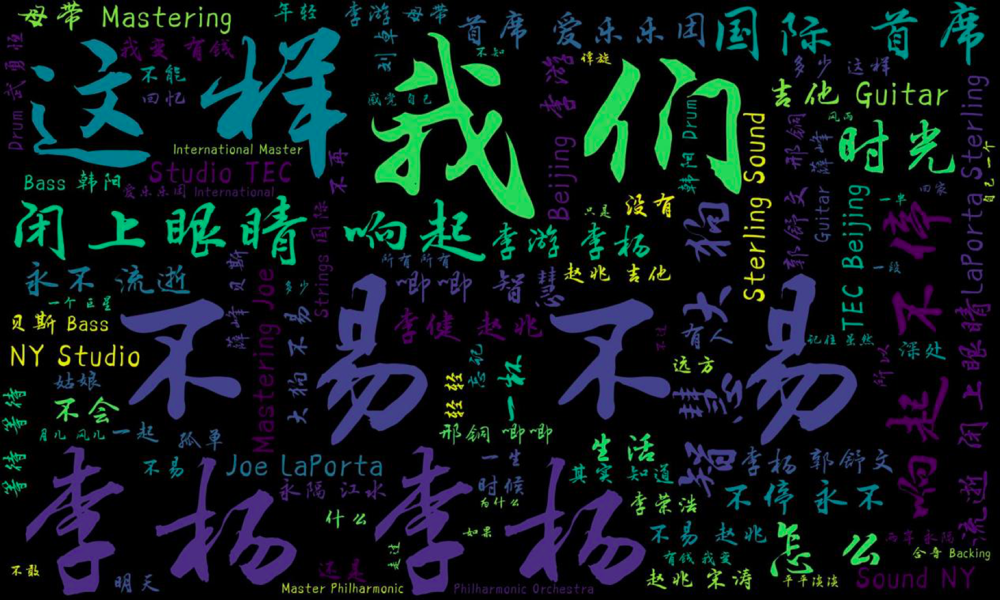

## 给毛不易的歌词制作词云

假设我们现在要给毛不易的歌词做个词云，那么需要怎么做呢？我们先把整个项目的流程梳理下：



在准备阶段：我们主要使用 Python 爬虫获取 HTML，用 XPath 对歌曲的 ID、名称进行解析，然后通过网易云音乐的 API 接口获取每首歌的歌词，最后将所有的歌词合并得到一个变量。

在词云分析阶段，我们需要创建 WordCloud 词云类，分析得到的歌词文本，最后可视化。

基于上面的流程，编写代码如下：

```python


# -- coding:utf-8 --

# 网易云音乐 通过歌手ID，生成该歌手的词云

import requests

import sys

import re

import os

from wordcloud import WordCloud

import matplotlib.pyplot as plt

import jieba

from PIL import Image

import numpy as np

from lxml import etree

 

headers = {

       'Referer'  :'http://music.163.com',

       'Host'     :'music.163.com',

       'Accept'   :'text/html,application/xhtml+xml,application/xml;q=0.9,image/webp,image/apng,/;q=0.8',

       'User-Agent':'Chrome/10'

    }

 

# 得到某一首歌的歌词

def get_song_lyric(headers,lyric_url):

    res = requests.request('GET', lyric_url, headers=headers)

    if 'lrc' in res.json():

       lyric = res.json()'lrc'

       new_lyric = re.sub(r'[\d:.[]]','',lyric)

       return new_lyric

    else:

       return ''

       print(res.json())

# 去掉停用词

def remove_stop_words(f):

    stop_words = ['作词', '作曲', '编曲', 'Arranger', '录音', '混音', '人声', 'Vocal', '弦乐', 'Keyboard', '键盘', '编辑', '助理', 'Assistants', 'Mixing', 'Editing', 'Recording', '音乐', '制作', 'Producer', '发行', 'produced', 'and', 'distributed']

    for stop_word in stop_words:

       f = f.replace(stop_word, '')

    return f

# 生成词云

def create_word_cloud(f):

    print('根据词频，开始生成词云!')

    f = remove_stop_words(f)

    cut_text = " ".join(jieba.cut(f,cut_all=False, HMM=True))

    wc = WordCloud(

       font_path="./wc.ttf",

       max_words=100,

       width=2000,

       height=1200,

    )

    print(cut_text)

    wordcloud = wc.generate(cut_text)

    # 写词云图片

    wordcloud.to_file("wordcloud.jpg")

    # 显示词云文件

    plt.imshow(wordcloud)

    plt.axis("off")

    plt.show()

# 得到指定歌手页面 热门前50的歌曲ID，歌曲名

def get_songs(artist_id):

    page_url = 'https://music.163.com/artist?id=' + artist_id

    # 获取网页HTML

    res = requests.request('GET', page_url, headers=headers)

    # 用XPath解析 前50首热门歌曲

    html = etree.HTML(res.text)

    href_xpath = "//*[@id='hotsong-list']//a/@href"

    name_xpath = "//*[@id='hotsong-list']//a/text()"

    hrefs = html.xpath(href_xpath)

    names = html.xpath(name_xpath)

    # 设置热门歌曲的ID，歌曲名称

    song_ids = []

    song_names = []

    for href, name in zip(hrefs, names):

       song_ids.append(href[9:])

       song_names.append(name)

       print(href, '  ', name)

    return song_ids, song_names

# 设置歌手ID，毛不易为12138269

artist_id = '12138269'

[song_ids, song_names] = get_songs(artist_id)

# 所有歌词

all_word = ''

# 获取每首歌歌词

for (song_id, song_name) in zip(song_ids, song_names):

    # 歌词API URL

    lyric_url = 'http://music.163.com/api/song/lyric?os=pc&id=' + song_id + '&lv=-1&kv=-1&tv=-1'

    lyric = get_song_lyric(headers, lyric_url)

    all_word = all_word + ' ' + lyric

    print(song_name)

#根据词频 生成词云

create_word_cloud(all_word)

```


运行结果：



这个过程里有一些模块，我需要说明下。

首先我编写 get_songs 函数，可以得到指定歌手页面中热门前 50 的歌曲 ID，歌曲名。在这个函数里，我使用 requests.request 函数获取毛不易歌手页面的 HTML。这里需要传入指定的请求头（headers），否则获取不到完整的信息。然后用 XPath 解析并获取指定的内容，这个模块中，我想获取的是歌曲的链接和名称。

其中歌曲的链接类似 /song?id=536099160 这种形式，你能看到字符串第 9 位之后，就是歌曲的 ID。

有关 XPath 解析的内容，我在第 10 节讲到过，如果你忘记了，可以看一下。一般来说，XPath 解析 99% 的可能都是以 // 开头，因为你需要获取所有符合这个 XPath 的内容。我们通过分析 HTML 代码，能看到一个关键的部分：id=‘hotsong-list’。这个代表热门歌曲列表，也正是我们想要解析的内容。我们想要获取这个热门歌曲列表下面所有的链接，XPath 解析就可以写成 //*[@id=‘hotsong-list’]//a。然后你能看到歌曲链接是 href 属性，歌曲名称是这个链接的文本。

获得歌曲 ID 之后，我们还需要知道这个歌曲的歌词，对应代码中的 get_song_lyric 函数，在这个函数里调用了网易云的歌词 API 接口，比如http://music.163.com/api/song/lyric?os=pc&id=536099160&lv=-1&kv=-1&tv=-1。

你能看到歌词文件里面还保存了时间信息，我们需要去掉这部分。因此我使用了 re.sub 函数，通过正则表达式匹配，将[]中数字信息去掉，方法为 re.sub(r’[\d:.[]]’,’’,lyric)。

最后我们还需要设置一些歌词中常用的停用词，比如“作词”“作曲”“编曲”等，编写 remove_stop_words 函数，将歌词文本中的停用词去掉。

最后编写 create_word_cloud 函数，通过歌词文本生成词云文件。

## 总结


词云工具 WordCloud，它是一个很好用的 Python 工具，可以将复杂的文本通过词云图的方式呈现。需要注意的是，当我们需要使用中文字体的时候，比如黑体 SimHei，就可以将 WordCloud 中的 font_path 属性设置为 SimHei.ttf，也可以设置其他艺术字体，在给毛不易的歌词做词云展示的时候，我们就用到了艺术字体。


